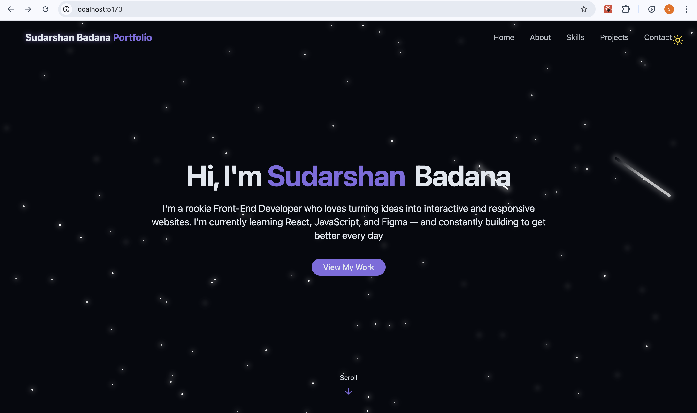

# 💻 Sudarshan Badana Portfolio



## 🚀 **[🌐 View Live Website](https://siddhusudarsh.github.io/folio-sid/)**

Welcome to my **Personal Portfolio Website**!  
This is a fully responsive front-end project made using **React.js** and **Tailwind CSS**, designed to showcase my skills, projects, and contact information in a sleek, interactive way.

**Live Demo:** https://siddhusudarsh.github.io/folio-sid/

---

## 🌟 About Me

Hi, I'm **Sudarshan Badana** — a rookie Front-End Developer who loves turning ideas into interactive and responsive websites. I'm currently learning:

- React.js ⚛️  
- JavaScript 🟨  
- Figma 🎨  

> I'm constantly building and improving — one line of code at a time.

---

## 🚀 Features

- 🔥 Modern, responsive design
- 🌙 Light/Dark mode toggle
- 🌌 Animated star background
- 🧠 Smooth navigation with React Router (if used)
- 📄 Clean UI with Tailwind CSS
- 🛠️ Projects, Skills, and Contact sections
- 📱 Mobile friendly

---

## 🛠️ Built With

- [React.js](https://reactjs.org/)
- [Tailwind CSS](https://tailwindcss.com/)
- [Vite](https://vitejs.dev/)

---


## 📦 Installation

1. Clone the repo:
   ```bash
   git clone https://github.com/your-username/your-repo-name.git

2. Navigate to the folder:
cd your-repo-name

3.Install dependencies:
npm install

4.Start the development server:
npm run dev

📫 Contact

Feel free to reach out via:

Email: siddhusudarshan66@gmail.com

